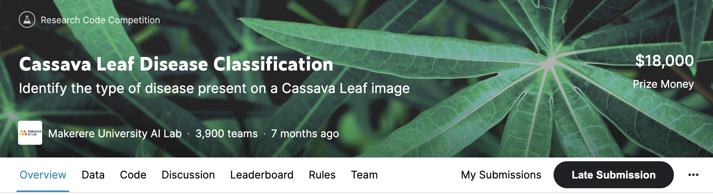

# Cassava Leaf Disease Classification
## Introduction

* 카사바 잎 이미지를 네가지 질병 혹은 건강한 잎인 5가지 범주로 분류하는 [이미지 분류대회](https://www.kaggle.com/c/cassava-leaf-disease-classification/overview)

* 최종 LB 상위 13%

## Solution
### 1. Data
  * merge 2019,2020 dataset

### 2. Model
   * *EfficientNet_b4_ns*
   * *ViT based 16-384*
    

### 3. Training Strategy
* **Augmentation** : Light augmentation, no cutmix
* **Stratified5Fold**
  
* **Loss function** : TaylorSmoothedLoss
* **Scheduler** : CosineAnnealingWarmRestarts

### 4. Inference
* **Ensemble** : 0.7 * Effficient_b4,  0.3   * VIT
* **TTA** : 4xTTA, 0.001-0.002 improvement in all experiments for both CV and LB

##  Review
캐글 첫 대회였는데 테스크 자체가 어렵지는 않은 이미지 분류 대회여서 
모델의 성능이 중요했던 것 같다. 이때는 Efficientnet과 vit가 sota 모델이였는데, 솔루션을 봐도 
이 두개의 모델 위주로 앙상블을 한다. 상위 랭킹의 점수 분포 또한 0.001차이로 이미지 4장 차이로 갈렸기 때문에, 여러가지 최신 기법들을 이용하여 조금이라도
점수를 끌어올리는게 중요했다. 

cv와 lb score가 비례하지 않아서 모델을 선택하는데 있어 너무나도 어려웠다. 대회 종료 전날까지
private 기준 상위 2%여서 안심했는데, 당일에 입상을 하지 못해서 매우 아쉬웠다.(2등이 백등으로 밀려날정도로 shakeup이 심했다)

오버피팅의 위험성 그리고 lb score 또한 cv 중 하나라고 여기고 실험관리를 더 철저히 해야겠다고 느꼈다.
