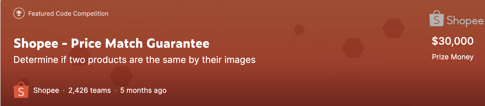
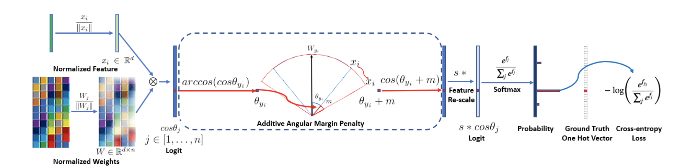

#Shopee - Price Match Gurantee
## 1. Introduction

2021년 [캐글](www.kaggle.com)에서 주최한 대회로 동남아시아의 이커머스 플랫폼인 [Shopee](https://www.kaggle.com/c/shopee-product-matching) 가 데이터를 제공하였다.
대회의 목적은 머신러닝을 이용하여 해당 상품이 어떤 상품 그룹군에 속하는지를 찾는 것이다. Train 데이터에는 한 상품 그룹군에 속하는 아이템들이 적게는 2개에서 많게는 50개까지 있었기에 단순한 이미지 분류문제는 아니였고, 상품 이미지 외에 주어지는 게시물 제목인 Title text 도 적절히 사용해야만 좋은 결과를 낼 수 있는 대회였다.

두 번째로 참여한 이번 캐글에서는 최종 189등(8%)로 [동메달](./img/rank)을 획득하였으나 팀병합 규정 위반으로 대회 이후에 취소되었다(대회 종료 5일 전까지는 코드를 공유한 팀원과 합병 필요하다).

## 2. Data

* [EDA](./EDA/RAPIDS%20cuML%20TfidfVectorizer%20and%20KNN.ipynb)

* 3.2만장의 학습 이미지와 해당 이미지에 대한 csv 파일이 제공된다. 데이터는 [이곳](https://www.kaggle.com/c/shopee-product-matching/data?select=train.csv) 에서 다운받을 수 있으며 메타데이터의 내용은 아래와 같다.

  * posting_id - the ID code for the posting. 
  * image - the image id/md5sum.
  * image_phash - a perceptual hash of the image. 
  * title - the product description for the posting. 
  * label_group - ID code for all postings that map to the same product. Not provided for the test set. 

## 3. Model, Train

 ### 3.1 ArcFace 
 
이번 대회를 하면서 새롭게 알게 된 것으로 대회에 참여한 대부분의 사람들은 **ArcFace Loss**([pdf](https://arxiv.org/abs/1801.07698)) 를 이용하였다.
일반적으로 CNN 모델에서 이미지가 레이어를 거치면서 N 차원의 임베딩 값들을 가지게 되고,
이 벡터값들이 마지막의 Fc layer 를 거치면서 클래스 분류가 된다. 여기서 마지막 이전 레이어의 임베딩 값들의 Cosine 혹은 Euclidean distance 를 계산함으로써
두 이미지의 비슷함 정도를 계산할 수 있다. ArcFace는 face recognition 문제 해결을 위해 나온 방법으로 softmax loss 를 사용했을 때, output vector가
class 수에 따라 선형적으로 증가하는 문제를 해결한다. 따라서 5000개 이상의 unique한 그룹들을 분류해내는 이번 대회에 적합하다고 이해하였다. 수식 설명은 [여기](https://zest-cloud-1fd.notion.site/ArcFace-861c433e11cf4da18d92890853639dd6)

### 3.2 Image Model

* [**Efficientnet_b3**](./train/EfficientNet.ipynb)
* [**eca_nfnet_l0**](./train/eca-nfnet-I0)
* [**eca_nfnet_l1**](./train/eca-nfnet-I0)
  
  위 3개의 모델로 학습을 진행하여 추론된 임베딩 값들을 concat 하여 상품 그룹군을 구했다. 
지난 대회에서는 vision transformer 모델과 CNN 계열 모델을 앙상블했을 때 성능이 좋았었는데 이번엔 그다지 좋지 못했다. 이미지 임베딩값들을 cuml 라이브러리에서 제공하는
KNN 알고리즘을 통해 벡터값들의 거리를 구해 최종 그룹군 예측을 하였다. 학습 데이터와 실제 리더보드 추론 시 테스트 셋 데이터의 크기가 달랐기 때문에 
계속 제출을 해보면서 threshold 값의 튜닝이 필요했다.

### 3.3 Text Model
* **TF-IDF embeddings**

    제공되는 데이터가 Text sequence 의 중요성이 크지 않은 판매글 제목 이였기 때문에, 딥러닝 기반의 텍스트 모델보다는
    단순히 타이틀 frequency 를 구하여 타이틀 간의 유사성을 계산하는 방법이 훨씬 효과적이였다. Tf 임베딩 벡터들의 코사인 거리를 구하여 최종 그룹군 예측을 했다.

* [**DistilBert-base Indonesian**](./train/DistillBert-base-Indonesian.ipynb)
* [**Roberta-base**](./train/Roberta_train%20.ipynb)
    
    Shopee가 동남아시아 회사이기 때문에 Indonesian 베이스 모델과 Roberta 모델을 사용했고 이미지와 마찬가지로 임베딩 값들을 concat하여 사용했다. 데이터가 작았기 때문에
    validation set을 만들지 않고 전체 데이터로 학습하는 방법과 낮은 에폭으로 cv score를 계산해보면서 학습하는 방법 두 가지로 논쟁이 있었는데, 오버피팅이 쉽게 되서 그런지
    후자가 조금 더 lb score 향상에 도움이 되었다. 

## 4. Inference
* [Ensemble Image models](./inference/Ensemble multiple_models.ipynb)
* [Bert](./inference/Bert Inference.ipynb)
* [Submission](./inference/submission.ipynb)
  
   
  Image, Tfidf , BERT 세 가지 학습된 모델의 임베딩 값들을 KNN,Cosine distance 등의 방법으로 post_id 별로 매치되는 그룹을 prediction. 이후
  모델별 예측값들의 unique set을 제출한다.

##5. etc
* [OCR](./EDA/OCR.ipynb)
  
    상품 이미지기 때문에 이미지에 상품 타이틀이 박혀있는 경우가 종종 있어서 pytesseract 등의 라이브러리를 이용하여 피쳐를 추가하려는 시도를 했으나 데이터셋 변환 시간이 너무 오래걸려 포기.
  

* Crawling
    
    대회 중간에 외부 데이터셋 사용이 금지되었다.
  

* Text, Image embeddings concat

  스코어가 떨어졌다. 이후에 보니 normalize 를 잘못했다.